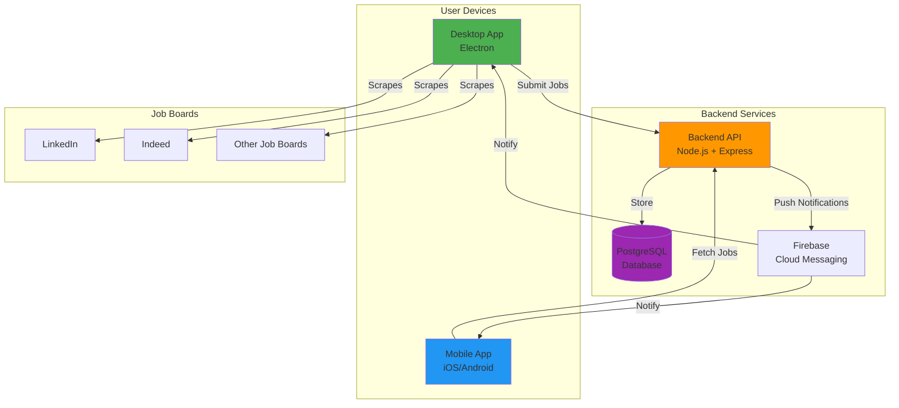
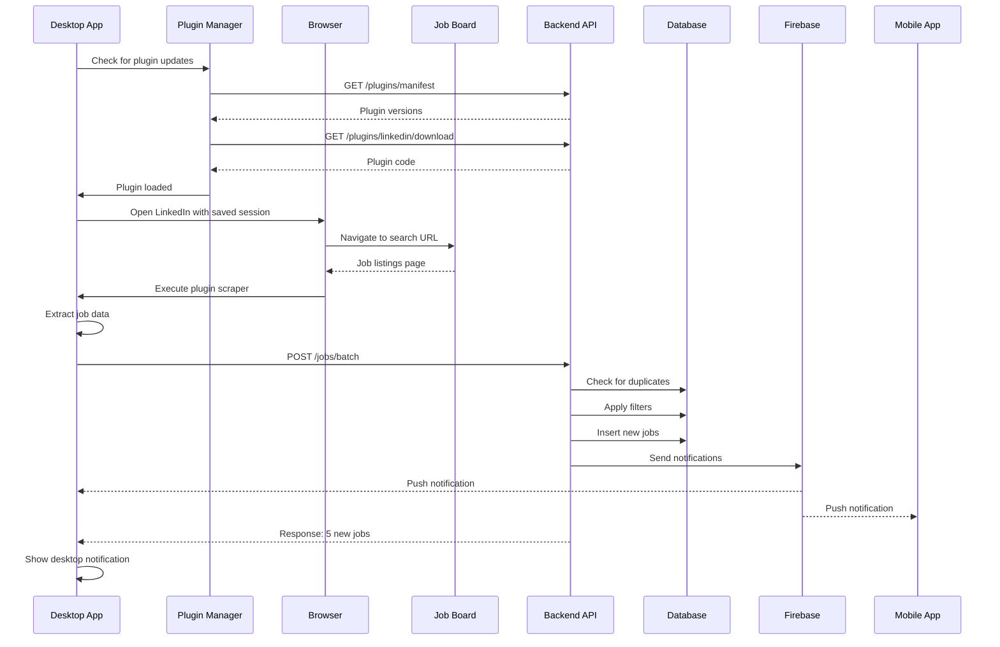
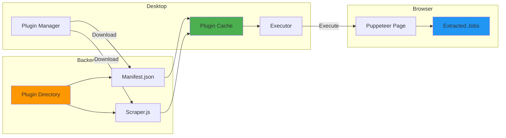
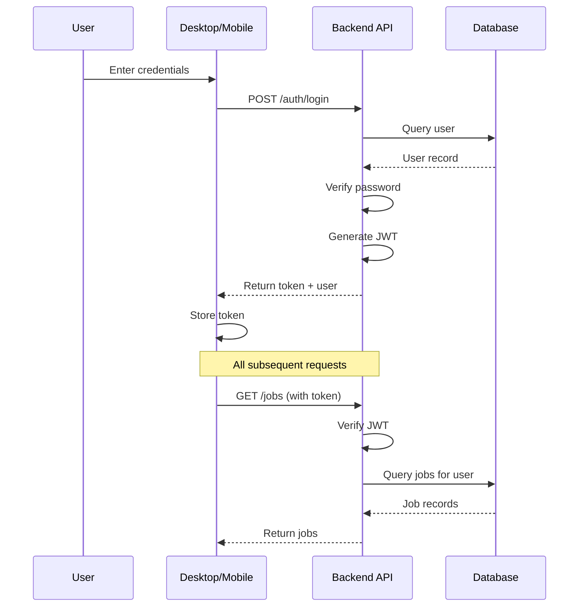
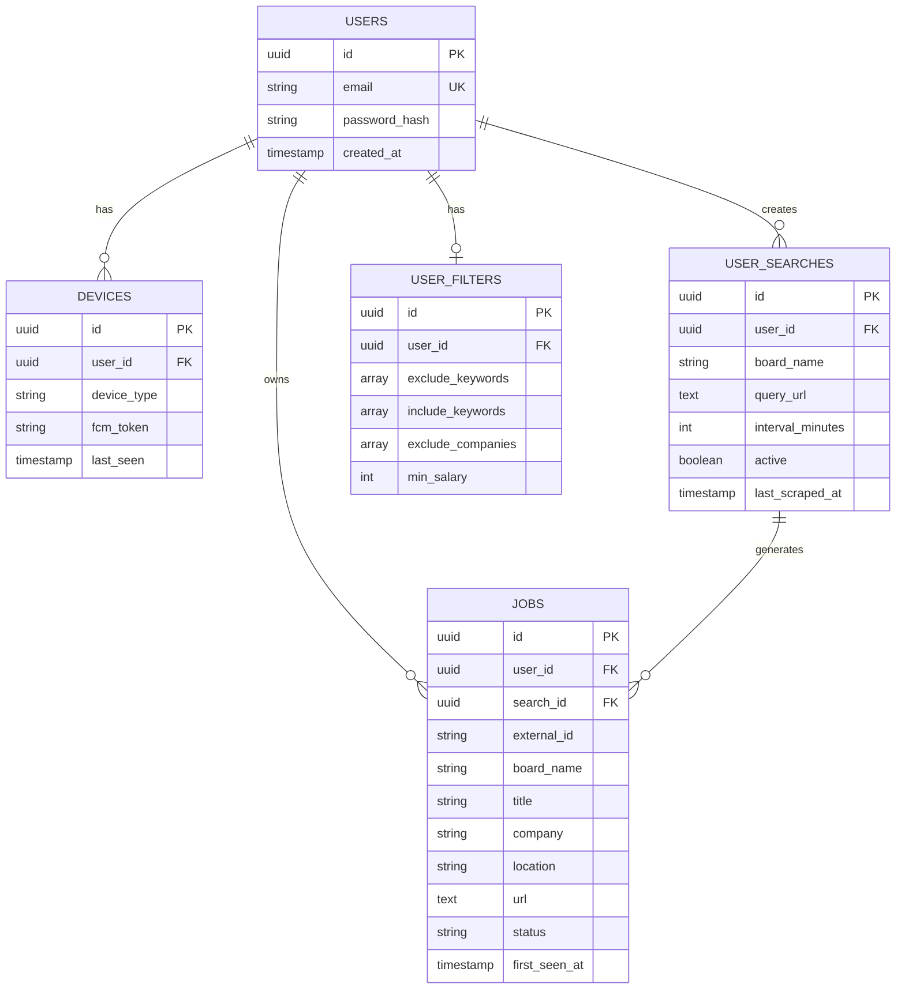
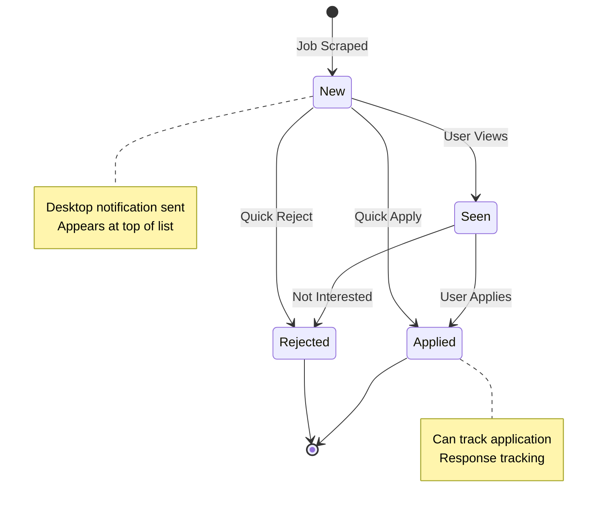
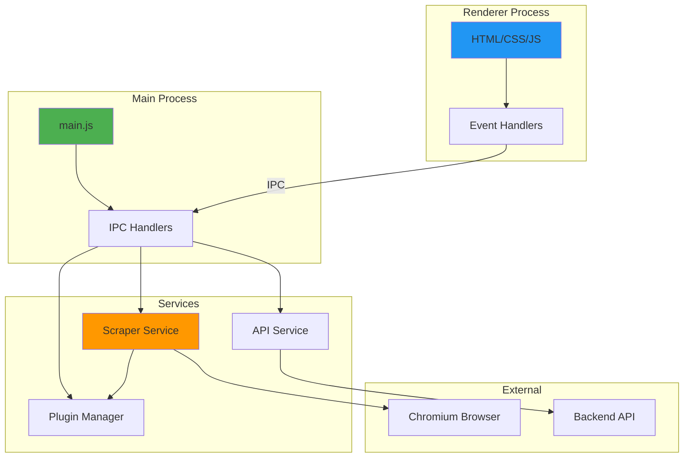
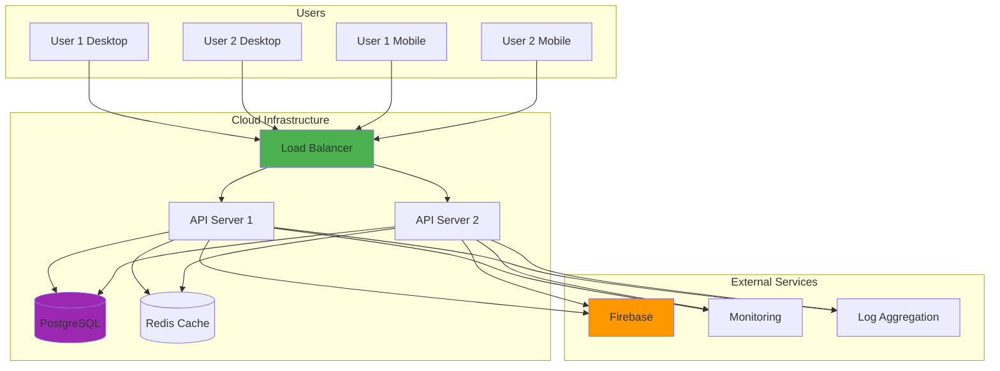
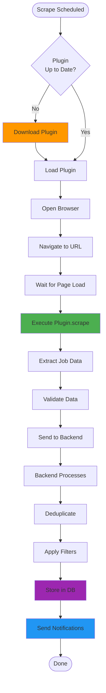

# Job Tracker - System Diagrams

## High-Level Architecture

## Data Flow - Job Scraping

## Plugin System

## User Authentication Flow

## Database Schema

## Job Status Lifecycle

## Desktop App Architecture

## Deployment Architecture

## Plugin Execution Flow

---

These diagrams illustrate:
1. High-level system architecture
2. Data flow during scraping
3. Plugin system design
4. Authentication flow
5. Database relationships
6. Job status lifecycle
7. Desktop app internal structure
8. Production deployment setup
9. Plugin execution process

For interactive versions, paste the Mermaid code into:
- https://mermaid.live
- GitHub (supports Mermaid in markdown)
- VS Code with Mermaid extension